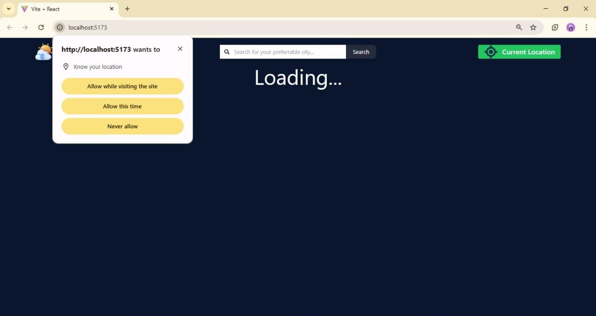

# React + Vite

This template provides a minimal setup to get React working in Vite with HMR and some ESLint rules.

Currently, two official plugins are available:

- [@vitejs/plugin-react](https://github.com/vitejs/vite-plugin-react/blob/main/packages/plugin-react) uses [Babel](https://babeljs.io/) for Fast Refresh
- [@vitejs/plugin-react-swc](https://github.com/vitejs/vite-plugin-react/blob/main/packages/plugin-react-swc) uses [SWC](https://swc.rs/) for Fast Refresh

## Expanding the ESLint configuration

If you are developing a production application, we recommend using TypeScript with type-aware lint rules enabled. Check out the [TS template](https://github.com/vitejs/vite/tree/main/packages/create-vite/template-react-ts) for information on how to integrate TypeScript and [`typescript-eslint`](https://typescript-eslint.io) in your project.

# Weather App Project

This is a weather application built with **React** and **Vite**. The app provides real-time weather information, including current weather, hourly forecasts, and a 5-day forecast. It also supports searching for weather by city name or fetching weather data for the user's current location using geolocation.

## Features

- **Current Weather**: Displays temperature, weather conditions, humidity, wind speed, air pressure, and UV index.
- **Hourly Forecast**: Shows weather predictions for the next few hours.
- **5-Day Forecast**: Provides a summary of weather conditions for the next 5 days.
- **Search by City/Pincode**: Allows users to search for weather data by entering a city name or pincode
- **Current Location Weather**: Fetches weather data for the user's current location using geolocation.
- **Sunrise and Sunset Times**: Displays the sunrise and sunset times for the selected location.
- **Responsive Design**: Optimized for both desktop and mobile devices.
- **Animated Weather Icons**: Uses `react-animated-weather` for visually appealing weather icons.
- **Error Handling**: Displays toast notifications for errors like invalid city names or geolocation issues.

## Tech Stack

- **React**: Frontend library for building the user interface.
- **Vite**: Build tool for fast development and optimized production builds.
- **Tailwind CSS**: Utility-first CSS framework for styling.
- **Axios**: For making API requests to the OpenWeather API.
- **React Toastify**: For displaying toast notifications.
- **React Animated Weather**: For animated weather icons.

## Project Structure
weather-app-project/
├── node_modules           # Project dependencies
├── public/                # Static assets
│   └── vite.svg
├── readmeSS               # weather app screenshots
├── src/                   # Source code
│   ├── assets/            # Images and icons
│   ├── components/        # Reusable React components
│   │   ├── NavBar.jsx     # Navigation bar for city search and geolocation
│   │   ├── CityAndTime.jsx # Displays city name, time, and weather details
│   │   ├── Clock.jsx      # Displays the current time and date
│   │   ├── Forecast.jsx   # Displays 5-day and hourly weather forecasts
│   │   ├── IconMapper.jsx # Maps weather codes to animated icons
│   ├── App.jsx            # Main application component
│   ├── main.jsx           # Entry point
│   ├── index.css          # Global styles
├── .env                   # Environment variables
├── .gitignore             # Git ignore rules
├── index.html             # HTML template
├── package.json           # Project metadata and dependencies
├── package-lock.json      # Lockfile for consistent dependency versions
├── postcss.config.js      # PostCSS configuration
├── tailwind.config.js     # Tailwind CSS configuration
├── vite.config.js         # Vite configuration
├── README.md              # Project documentation


## Installation

1. Clone the repository:
```bash
git clone https://github.com/your-username/weather-app-project.git
cd weather-app-project
```
2.   Install dependencies:
```bash
npm install
```
3. Create a .env file in the root directory and add your OpenWeather API key:
```env
VITE_OPENWEATHER_API_KEY=your_api_key_here
```
 *(Replace `your_api_key_here` with your actual API key)*
4. Start the development server:
```bash
npm run dev
```
5.  Open the app in your browser at [http://localhost:5173](http://localhost:5173).


## Scripts

- `npm run dev`: Start the development server.
- `npm run build`: Build the app for production.
- `npm run preview`: Preview the production build.
- `npm run lint`: Run ESLint to check for code issues.

## API Integration

This app uses the [OpenWeather API](https://openweathermap.org/api) to fetch weather data. Ensure you have a valid API key and add it to the `.env` file.

## Screenshots




## Live Demo

Check out the live demo: [https://your-demo-url.com](https://your-demo-url.com)

## Acknowledgements

- [OpenWeather API](https://openweathermap.org/api) for providing weather data.
- [React Animated Weather](https://github.com/erikflowers/weather-icons) for animated weather icons.
- [React Toastify](https://fkhadra.github.io/react-toastify/) for toast notifications.
- [Tailwind CSS](https://tailwindcss.com/) for styling.
- [Axios](https://axios-http.com/) for promise-based HTTP requests.

## License

This project is licensed under the MIT License. 